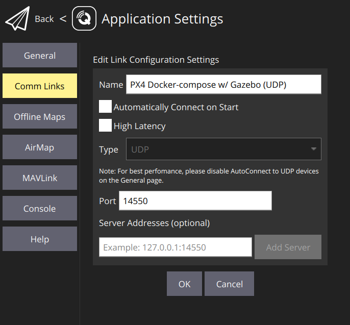

# Running a simulation

This is the easiest way to get started without the need of additional hardware,
apart from you laptop.

## Software requirements

Operating system: Linux / MacOS(?)

(?) - Currently being tested

- Docker and Docker-compose for simulation (Install [Docker][install-docker] & [docker-compose][install-docker-compose])
- Rust for `cargo run` (Install the [Rust][install-rust] programming language)
- Git
- `ssh` key set on your GitHub profile, see [Connecting to GitHub with SSH][github-ssh]
- [QGroundControl (optional)](#qgroundcontrol-docker)
- `protoc` for running the `mav-sdk` build script when using the examples, see [Protocol Compiler Installation][install-protoc]. Since `prost` version `0.11`, `protoc` is no longer automatically installed on the host machine.

1. `git clone git@github.com:AeroRust/mav.git && cd mav`

    1.1. Install `protoc` - For [Windows](https://www.geeksforgeeks.org/how-to-install-protocol-buffers-on-windows/), [Linux & mac](https://grpc.io/docs/protoc-installation/)

    1.2. `git submodule init && git submodule update`


2. Run PX4, Gazebo and MAVSDK Server with `docker-compose`


```
docker-compose up --detach
```

**Tools:** `PX4` (autopilot), `Gazebo` (a tool for simulations) and `MAVSDK` server are all open-source tools and later we will get to know what each tool does.

For the time being, however, all you need to know is that this is how we simulate a drone using Docker containers.

3. Take it to the skies

```
cargo run -p mav-sdk --example takeoff
```

### QGroundControl Docker

> QGroundControl provides full flight control and mission planning for any MAVLink enabled drone. Its primary goal is ease of use for professional users and developers. All the code is open-source source, so you can contribute and evolve it as you want.
- _[qgroundcontrol.com][qgroundcontrol]_

In order to connect to the PX4 running inside Docker, use this setup:



### Connecting Gazebo GUI (client) to Gazebo server (in Docker)

The `Gazebo` simulation tool usually runs a server and a GUI on the host machine,
however, our setup is running in `Docker` with mode `headless` for `Gazebo`,
so we only have the server running in `Docker`.

**IMPORTANT:** You must have installed the exact same `Gazebo` version locally as the one found in the Docker setup, otherwise you won't be able to connect

On Linux:

```bash
source /usr/share/gazebo-11/setup.sh && \
gzclient --verbose
```

`/usr/share/gazebo-11/setup.sh` contains a few default environment variables that you don't need to pass, otherwise use:

```
GAZEBO_MASTER_URI=127.0.0.1:11345 gzclient --verbose
```

[install-rust]: https://rustup.rs/
[install-protoc]: https://github.com/protocolbuffers/protobuf#protocol-compiler-installation
[install-docker]: https://docs.docker.com/engine/install/
[install-docker-compose]: https://docs.docker.com/compose/install/
[github-ssh]: https://docs.github.com/en/authentication/connecting-to-github-with-ssh
[qgroundcontrol]: http://qgroundcontrol.com